# ITGlue Python SDK - Deployment Guide

This document provides comprehensive instructions for deploying the ITGlue Python SDK to PyPI and managing the CI/CD pipeline.

## 🚀 Quick Start for Releases

### Automated Release (Recommended)
```bash
# 1. Update version and changelog
echo "0.2.1" > itglue/version.py  # Update version
# Edit CHANGELOG.md to add new version section

# 2. Commit changes
git add .
git commit -s -m "feat: bump version to 0.2.1"

# 3. Create and push tag
git tag v0.2.1
git push origin main
git push origin v0.2.1
```

The GitHub Actions workflow will automatically:
- ✅ Build and test the package
- ✅ Publish to PyPI
- ✅ Create GitHub release with changelog
- ✅ Attach distribution files

## 📋 Prerequisites

### 1. GitHub Repository Setup
- [ ] Repository has main branch protection
- [ ] Actions are enabled
- [ ] Environments configured (optional but recommended)

### 2. PyPI Account Setup
- [ ] PyPI account created: https://pypi.org/account/register/
- [ ] TestPyPI account created: https://test.pypi.org/account/register/
- [ ] API tokens generated for both

### 3. GitHub Secrets Configuration
Navigate to: Repository → Settings → Secrets and variables → Actions

#### Required Secrets:
```
PYPI_API_TOKEN=pypi-xxxxxxxxxxxx
TEST_PYPI_API_TOKEN=pypi-xxxxxxxxxxxx
```

#### Optional Secrets:
```
CODECOV_TOKEN=xxxxxxxxxxxx  # For coverage reporting
```

### 4. Development Environment
```bash
# Install development dependencies
pip install -e .[dev,testing]

# Install pre-commit hooks
pre-commit install

# Verify setup
python -m pytest tests/
```

## 🔄 CI/CD Pipeline Overview

### Workflow Triggers

| Workflow | Trigger | Purpose |
|----------|---------|---------|
| **CI** | Push/PR to main/develop | Testing & Quality checks |
| **Release** | Git tags (v*) | PyPI deployment |
| **Scheduled** | Weekly (Mondays) | Proactive monitoring |

### Release Workflow Logic

```mermaid
graph TD
    A[Git Tag Push] --> B[Extract Version]
    B --> C{Version Match?}
    C -->|No| D[❌ Fail]
    C -->|Yes| E[Build Package]
    E --> F[Run Tests]
    F --> G{Tests Pass?}
    G -->|No| D
    G -->|Yes| H{Tag Contains '-'?}
    H -->|Yes| I[Deploy to TestPyPI]
    H -->|No| J[Deploy to PyPI]
    J --> K[Create GitHub Release]
```



## 📦 Package Building

### Local Testing
```bash
# Build package locally
python -m build

# Check distribution
twine check dist/*

# Test upload to TestPyPI
twine upload --repository testpypi dist/*

# Install from TestPyPI to verify
pip install --index-url https://test.pypi.org/simple/ py-itglue
```

### Package Structure Verification
```bash
# Verify package contents
tar -tf dist/py-itglue-*.tar.gz | head -20
unzip -l dist/py_itglue-*.whl | head -20
```

## 🔖 Version Management

### Version Consistency Requirements
- `itglue/version.py` version must match git tag
- Tag format: `v{major}.{minor}.{patch}` (e.g., `v0.2.0`)
- Pre-release tags: `v{major}.{minor}.{patch}-{pre}` (e.g., `v0.2.0-beta1`)

### Semantic Versioning Guidelines
- **MAJOR** (v1.0.0 → v2.0.0): Breaking API changes
- **MINOR** (v1.0.0 → v1.1.0): New features, backward compatible
- **PATCH** (v1.0.0 → v1.0.1): Bug fixes, backward compatible

### Version Update Process
```bash
# 1. Update version file
vim itglue/version.py  # Change __version__ = "x.y.z"

# 2. Update changelog
vim CHANGELOG.md  # Add new [x.y.z] section

# 3. Commit and tag
git add itglue/version.py CHANGELOG.md
git commit -s -m "feat: release version x.y.z"
git tag vx.y.z
git push origin main vx.y.z
```

## 🧪 Testing Strategy

### Pre-release Testing
```bash
# Test installation from TestPyPI
pip install --index-url https://test.pypi.org/simple/ --extra-index-url https://pypi.org/simple/ py-itglue==x.y.z-beta1

# Verify functionality
python -c "import itglue; print(itglue.__version__)"
```

### Integration Testing
```bash
# Create clean environment
python -m venv test_env
source test_env/bin/activate

# Install from PyPI
pip install py-itglue

# Test basic functionality
python -c "
from itglue import ITGlueClient
from itglue.config import ITGlueConfig
config = ITGlueConfig(api_key='test')
client = ITGlueClient(config)
print('✅ Installation successful')
"
```

## 🔐 Security Considerations

### API Token Management
- Use separate tokens for TestPyPI and PyPI
- Rotate tokens periodically
- Use repository secrets, not organization secrets
- Enable token scope restrictions

### Package Security
- All dependencies are security-scanned
- Bandit security analysis on every commit
- Safety vulnerability checks
- Semgrep static analysis

### Supply Chain Security
```bash
# Verify package integrity
pip install --force-reinstall --no-deps py-itglue
python -c "import itglue; print(itglue.__file__)"

# Check for unexpected files
python -c "import itglue; import os; print(os.listdir(os.path.dirname(itglue.__file__)))"
```

## 🐛 Troubleshooting

### Common Deployment Issues

#### 1. Version Mismatch Error
```bash
Error: Version mismatch: package version (0.2.0) != tag version (0.2.1)
```
**Solution**: Update `itglue/version.py` to match the git tag.

#### 2. PyPI Upload Failure
```bash
Error: 403 Forbidden
```
**Solutions**:
- Verify API token is correct and has upload permissions
- Check if package name already exists
- Ensure account has 2FA enabled (required for PyPI)

#### 3. Test Failures in CI
```bash
Error: ModuleNotFoundError: No module named 'xyz'
```
**Solutions**:
- Add missing dependency to `setup.py` or `requirements.txt`
- Check for platform-specific dependencies
- Verify Python version compatibility

#### 4. Build Failures
```bash
Error: invalid command 'bdist_wheel'
```
**Solution**: Install build dependencies:
```bash
pip install build wheel setuptools
```

### Debugging Workflows

#### Local Workflow Testing
```bash
# Install act for local testing
brew install act  # macOS
# or
curl https://raw.githubusercontent.com/nektos/act/master/install.sh | sudo bash

# Run workflow locally
act push -W .github/workflows/ci.yml
```

#### Workflow Logs Analysis
1. Go to repository → Actions
2. Select failing workflow
3. Expand failed step
4. Check "Raw logs" for detailed output

## 📊 Monitoring and Metrics

### Release Health Indicators
- ✅ All CI checks pass consistently
- ✅ Package downloads trending upward
- ✅ No security vulnerabilities detected
- ✅ Documentation stays current

### Performance Monitoring
```bash
# Package size tracking
ls -lh dist/py_itglue-*.whl  # Should be < 1MB

# Import time measurement
python -c "import time; start=time.time(); import itglue; print(f'Import time: {time.time()-start:.3f}s')"

# Memory usage
python -c "import psutil; import os; import itglue; print(f'Memory: {psutil.Process(os.getpid()).memory_info().rss/1024/1024:.1f}MB')"
```

## 🔗 Useful Links

- **PyPI Project**: https://pypi.org/project/py-itglue/
- **TestPyPI Project**: https://test.pypi.org/project/py-itglue/
- **GitHub Repository**: https://github.com/your-org/py-itglue
- **Documentation**: https://py-itglue.readthedocs.io/
- **Issue Tracker**: https://github.com/your-org/py-itglue/issues

## 📞 Support

For deployment issues:
1. Check this guide first
2. Review GitHub Actions logs
3. Search existing issues
4. Create new issue with detailed logs and steps to reproduce

---

**Note**: This guide assumes you have proper permissions for the GitHub repository and PyPI packages. Contact repository maintainers if you need access. 